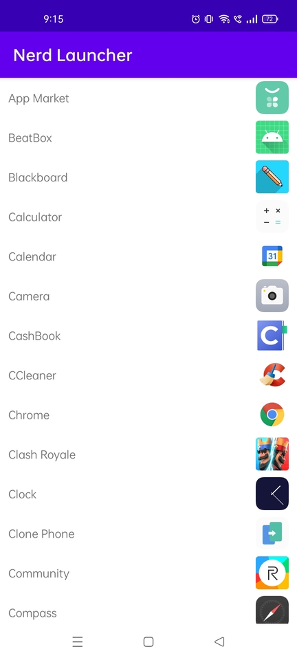
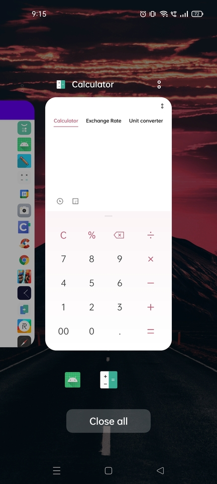

# Nerd Launcher

## Synopsis

Nerd Launcher is a launcher app which displays a list of apps on the device. The user will press
any app to launch it. The user can even replace the default launcher screen with this app.

## Table of Contents

> * [Title](#nerd-launcher)
> * [Synopsis](#synopsis)
> * [Table of Contents](#table-of-contents)
> * [Features](#features)
> * [Installation Guide](#installation-guide)
> * [Preview](#preview)
> * [Resources](#resources)

## Features

* Launch apps with the help of a single click.
* Lexicographically arranged apps.

## Installation Guide

Clone the repository and import into Android Studio

```bash
https://github.com/AKSingh18/NerdLauncher.git
```

For a quick installation download the [apk](apk/app-debug.apk)

## Preview

  

## Resources

* [Android Programming - The Big Nerd Ranch Guide](https://bignerdranch.com/books/android-programming-the-big-nerd-ranch-guide-4th-edition/)
* [Android Developers](https://developer.android.com/)